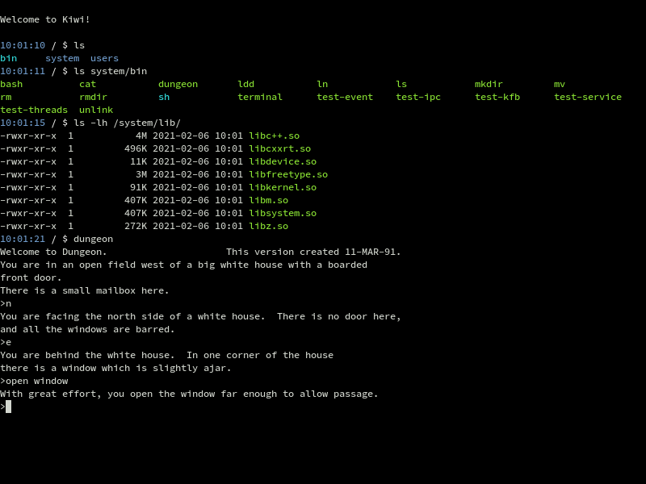
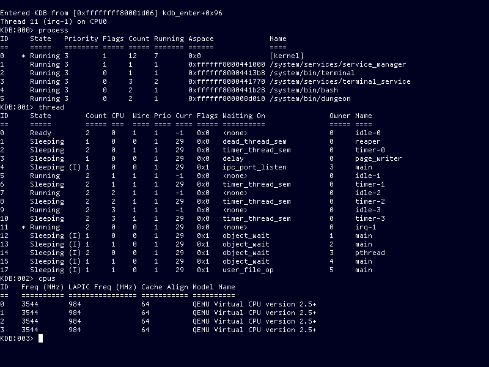

Kiwi
====

Kiwi is an open source operating system supporting 64-bit x86 PCs. It uses a
custom kernel design/API, taking inspiration from both POSIX and Windows NT.
Some POSIX/UNIX compatibility is implemented by userspace libraries on top of
the native kernel API, which is currently capable of running some UNIX command
line software such as Bash.

Screenshots
-----------

Building
--------

To build Kiwi you need the following prerequisites:

 * SCons 3.x
 * ncurses
 * xorriso
 * mtools
 * dosfstools

Kiwi makes use of git submodules to include various pieces of 3rd party
software it uses. These must be cloned after this repository has been cloned
by running:

    $ git submodule update --init

You must then create a build configuration file by running:

    $ scons config

In that menu you will at least need to change the "Toolchain directory" option
under "Build options", to point to a location in which to install the Kiwi
cross-compiler. This location must be writable by your user. You may also wish
to change the toolchain build jobs option to e.g. the number of CPU cores in
your system to speed up the toolchain build.

After saving the configuration file, build the toolchain (only needs to be done
once) by running:

    $ scons toolchain

Finally, build the system with:

    $ scons

This should produce a bootable ISO image in `build/amd64-pc`. To boot this
image in QEMU, you can run:

    $ scons qemu

License
-------

Kiwi is licensed under the terms of the [ISC license](documentation/licenses/isc.txt).
