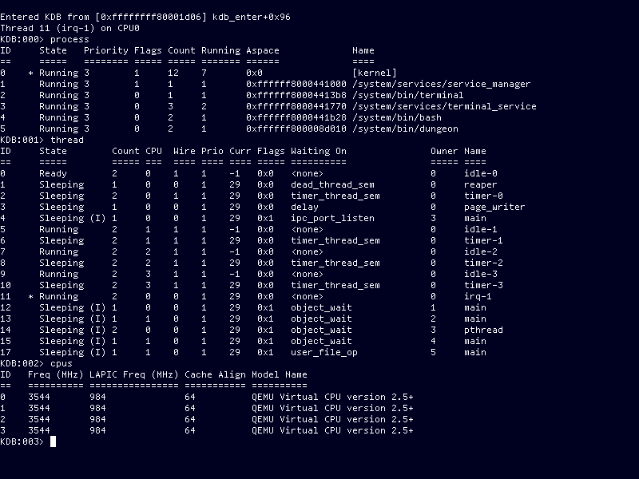

Screenshots
===========

Xterm-compatible terminal emulator, with TrueType font rendering, running Bash:

Kernel debugger inspecting process/thread state:

Early bring-up of ARM64 port on a Raspberry Pi:

